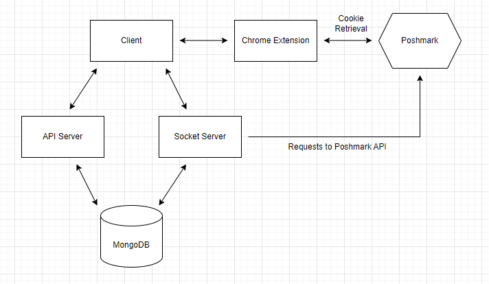

# Clozedo - Virtual Assistant and Data Visualization Tool for Poshmark Sellers

Clozedo is a full-stack application made for sellers on Poshmark to enhance their business decisions and automate tasks. Features include advanced analytics on sales data, scheduled listing refreshing, and automated discount sending.

## Table of Contents

- [System Design](#system-design)
- [Features](#features)

## [System Design](#system-design)

### Overview



### Client (React.js)
This renders the user interface and handles user interactions. Tailwind CSS is utilized for styling, and Chart.js is used for creating visualizations of the user's sales data. The video below shows the user dashboard.


### API Server (Node.js with Express.js)
The backend's entry point is in ```main/server.js```. It provides RESTful APIs for the frontend to interact with the application, such as fetching user info or sales data from the database. ```server.js``` utilizes several different helper scripts to perform tasks upon user requests. These scripts can be found in ```main/src/scripts```.


### Database (MongoDB)
Application data and unique user records are stored here. The MongoDB contains the following databases: user_activity, user_sales_data, user_settings. To make website intialization quicker, the front end utilizes secureLocalStorage to cache information. 


### Socket Server (Socket.io)
The socket server is built within ```main/socket.js```. It establishes connections with the frontend client to provide real-time updates on user activity. Upon initialization, a ```va_worker``` object is created for the user that handles auto-offering, sales data updating, and listing refreshing. When these tasks take place, updates are posted to ```user_activity``` in the MongoDB and the socket connection updates the users Activity Board live.


### Chrome Extension
When setting up Clozedo for the first time, the chrome extension establishes your Poshmark connection. When linking your Poshmark account, Clozedo will update a cookie that the chrome extension listens for. When this cookie change happens, the chrome extension will use the Poshmark instance opened in another tab. The extension will then make a cookie update on the Clozedo website to indicate that this process is done. This process occurs every time you delink and relink your Poshmark account.


## [Features](#features)
### Sales Analytics
In the Clozedo dashboard is a "Dashboard" section. Here, you will find broad statistics on your closet data, like active listings and total sales. There are also a few high level graphs. Using the settings icon in the top right, you can filter the data by time or brand. In the "Analytics" section, you will find more advanced and specific statistics and visualizations. Here, you can also filter by time or brand. On both pages, you will find an "Update Data" button where you can update your data to include your recent sales.


### Automated Sharing
On Poshmark, you can share your listings to show them at the top of a search when customers are searching for an item. Clozedo provides automatic sharing. In the "Refresher" tab, you will see a "Sharer" section which provides three ways to share your closet's items. The first setting is scheduled sharing. Here, you can specify times for your items to be shared every day. The second setting is continuous sharing. This will share your closet on a set interval. The third setting will share your items one time.


### Automated Offering
This feature is located in the "Refresher" tab. When enabled, Clozedo will automatically send Poshmark users who like your listings a discount offer. You can specify minimum prices and how big of a discount you want to send.


### Activity Board
This feature is located in the "Refresher" tab. Here, you will see activity updates. The activity board will update when your items are being refreshed, offers are sent out, or when your sales data is being updated.

